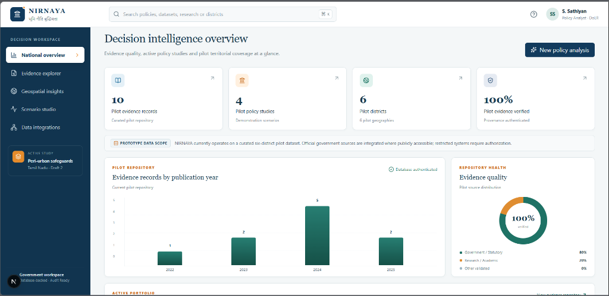
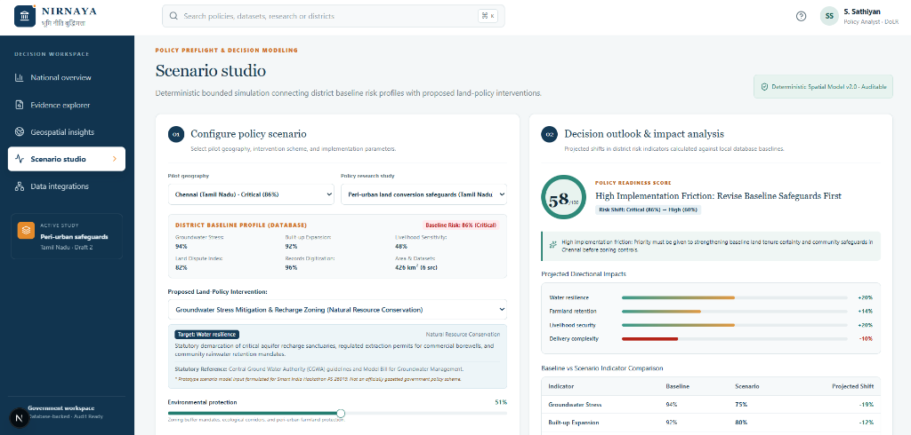
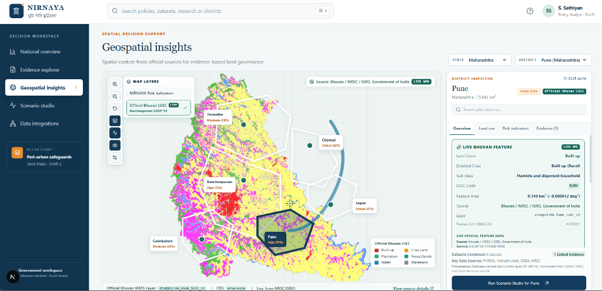

# 🏛️ NIRNAYA — Land Policy Intelligence

> **भूमि नीति बुद्धिमत्ता | Evidence-to-Decision Intelligence Portal for Indian Land Governance**

NIRNAYA is a digital public infrastructure (DPI) decision-support portal designed to bridge empirical research, spatial land vector datasets, and statutory land policies in India. It enables government policy analysts, land administration officials, and researchers to perform transparent, auditable multi-criteria policy assessments and generate formal decision briefs.

---

## 📸 Prototype Screenshots & Visual Showcase

<div align="center">

### 📊 1. National Decision Intelligence Overview
*Unified dashboard displaying pilot evidence quality, active policy studies, publication timeline distribution, and baseline repository metrics.*



<br/>

### 🧪 2. Scenario Studio (Policy Preflight & Simulation)
*Deterministic multi-criteria spatial policy modeling connecting district baseline risk profiles with proposed land-policy interventions.*



<br/>

### 🗺️ 3. Geospatial Insights & Land Governance Map
*Live spatial decision support integrating official ISRO Bhuvan LULC (Land Use / Land Cover) vector layers, district indicators, and official feature inspection.*



</div>

---

## ✨ Core Features & Capabilities

- **📊 Decision Intelligence Dashboard**: Real-time aggregation of pilot evidence records, statutory policy studies, pilot territorial coverage, and provenance verification status.
- **🧪 Deterministic Scenario Studio**: Bounded multi-criteria decision preflight engine. Simulates directional shifts in water resilience, farmland retention, livelihood security, and implementation friction score without black-box AI hallucination.
- **🗺️ Geospatial Decision Support**: Live WMS/vector map integration featuring ISRO Bhuvan Land Use / Land Cover (LULC) layers, district risk profiling (Groundwater stress, Built-up expansion, Land dispute index, Records digitization).
- **📚 Evidence Explorer & Audit**: Searchable pilot evidence repository categorized by publication year, statutory references, and data authentication flags.
- **📄 Auditable Decision Briefs**: Automated generation of formal, executive policy decision briefs formatted with official headers, statutory references, and directional impact projections.
- **🔌 Government Data Integration Framework**: Modular adapters for Open Government Data (OGD India), ISRO Bhuvan, DILRMP, ULPIN, and statutory state revenue systems.

---

## 🛠️ Tech Stack & Architecture

- **Frontend**: Next.js 16 (App Router), React 19, Tailwind CSS v4, Radix UI Primitives, Lucide Icons, Recharts.
- **Backend & Database**: Next.js API Routes, Drizzle ORM, LibSQL / SQLite (`nirnaya.db`), TypeScript (`tsx`).
- **Geospatial & Data Integration**: WMS integration with ISRO Bhuvan service protocols and OGD India datasets.

```
NIRNAYA_Structured_Source_Code/
│
├── frontend/                     # Next.js React Frontend Application
│   ├── app/                      # Next.js App Router (Layouts, Pages, Client Routes)
│   │   ├── api/                  # API Proxy Handlers & Server Endpoints
│   │   ├── login/                # Authentication & Session Views
│   │   ├── globals.css           # Global Theme Tokens & Tailwind CSS
│   │   ├── layout.tsx            # Root HTML Shell & Providers
│   │   └── dashboard-client.tsx  # Dynamic Decision Intelligence Workspace
│   ├── components/               # Modular UI Primitives & Domain Components
│   └── public/screenshots/       # High-Resolution Application Screenshots
│
├── backend/                      # Backend Core, Database & Services
│   ├── api/                      # Modular REST v1 Endpoints & Auth Handlers
│   ├── db/                       # Drizzle ORM Schema & SQLite Client (`nirnaya.db`)
│   ├── services/                 # Scenario Simulation Engine & Portal Adapters
│   └── scripts/                  # Seeders, OGD Initializers & Database Auditing
│
├── docs/                         # Technical Specs & Documentation
│   └── screenshots/              # README Visual Assets & Prototype Captures
│
├── resources/                    # Research Data, Bhuvan Metadata & Verification Scripts
├── package.json                  # Root Monorepo Scripts & Dependency Config
└── tsconfig.json                 # Path Mappings (@/frontend/*, @/backend/*)
```

---

## 🚀 Quick Start Guide

### Prerequisites
- **Node.js** `>=22.13.0` ([nodejs.org](https://nodejs.org/))
- **pnpm** (`npm install -g pnpm`)

### 1. Installation
```bash
# Clone the repository
git clone https://github.com/your-org/nirnaya-land-policy-portal.git
cd nirnaya-land-policy-portal

# Install dependencies
pnpm install
```

### 2. Environment Setup
```bash
cp .env.example .env.local
```

### 3. Initialize & Seed Database
Populate local SQLite database (`nirnaya.db`) with baseline evidence records, district risk profiles, and policy scenarios:
```bash
pnpm db:seed
```

### 4. Run Development Server
```bash
pnpm dev
```
Open **[http://localhost:3000](http://localhost:3000)** in your browser.

---

## ⚡ npm / pnpm Command Registry

| Command | Description |
|:---|:---|
| `pnpm dev` | Launch Next.js dev server on port 3000 |
| `pnpm build` | Compile optimized production build |
| `pnpm start` | Start production server |
| `pnpm db:seed` | Seed `nirnaya.db` with pilot evidence and district data |
| `pnpm db:audit` | Execute automated integrity & quality audit on local database |
| `pnpm db:generate` | Generate Drizzle SQL migrations from schema |
| `pnpm lint` | Run ESLint across frontend and backend code |

---

## 🌐 REST API Specifications

| Method | Endpoint | Description |
|:--- |:--- |:--- |
| `GET` | `/api/v1/dashboard` | Aggregated decision metrics, verification rates, and active study counts |
| `GET` | `/api/v1/evidence` | Query pilot evidence repository with keyword search and year filters |
| `GET` | `/api/v1/geo/districts` | Retrieve multi-criteria indicator profiles for pilot districts |
| `GET` | `/api/v1/connectors` | Active external data integrations status (Bhuvan, OGD, DILRMP) |
| `POST` | `/api/v1/scenarios/run` | Execute deterministic multi-criteria policy scenario simulation |
| `POST` | `/api/v1/scenarios/brief` | Compile and format executive decision brief |
| `POST` | `/api/auth/login` | Authenticate government user session |
| `GET` | `/api/auth/session` | Inspect active session payload |

---

## 🛡️ Data Governance & Transparency

- **Deterministic Policy Modeling**: The Scenario Studio uses transparent mathematical scoring functions. It does **not** rely on opaque generative AI models for policy predictions.
- **Pilot Data Authorization**: Demonstrations utilize a curated 6-district pilot dataset. Live statutory land system connectors (ULPIN, DILRMP) require formal authorization and API credentials.

---

## 📜 License

Maintained for public interest digital public infrastructure (DPI) research and evidence-based land governance demonstration.

