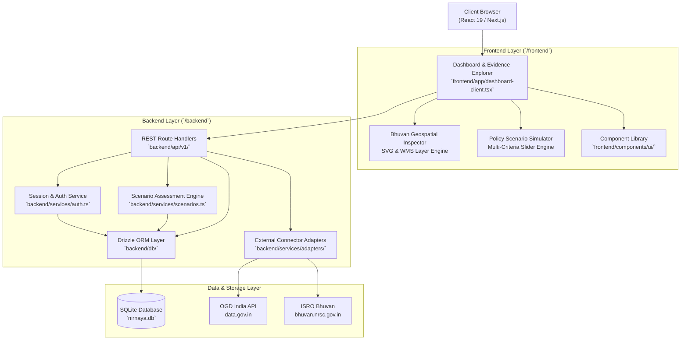

# System Architecture — NIRNAYA Land Policy Intelligence

NIRNAYA is an evidence-to-decision portal engineered to assist state and national land governance authorities in India with evidence aggregation, spatial risk modeling, and multi-criteria policy scenario simulation.



---

## 1. Directory Structure Organization

```text
NIRNAYA/
├── frontend/                     # Modern Next.js React Frontend Application
│   ├── app/                      # Next.js App Router (Layouts, Pages, Client Routes)
│   │   ├── api/                  # API Route Proxies / Handlers (interfacing with Backend)
│   │   ├── login/                # Authentication & Session Login Views
│   │   ├── globals.css           # Global Theme & Design Tokens
│   │   ├── layout.tsx            # Root HTML & Shell Layout
│   │   ├── page.tsx              # Main Entry View
│   │   └── dashboard-client.tsx  # Dynamic Decision Intelligence Portal
│   ├── components/               # UI Primitives & Domain Components
│   │   └── ui/                   # Modular Radix / Shadcn UI components
│   ├── hooks/                    # Reusable React Hooks (e.g. use-mobile.ts)
│   ├── lib/                      # Frontend Utility helpers (cn, utils.ts)
│   ├── public/                   # Static Assets, SVGs, Favicons, Public Logos
│   └── vendor/                   # Core Tailwind/Shadcn Stylesheet Bundle
│
├── backend/                      # Backend Architecture, Database & Business Logic
│   ├── api/                      # Modular API Controllers / Endpoints
│   │   ├── auth/                 # Authentication, Login, Signup, Session APIs
│   │   └── v1/                   # Core REST v1 APIs (Dashboard, Evidence, Geo, Scenarios, Connectors, OGD)
│   ├── db/                       # Drizzle ORM Database Layer
│   │   ├── schema.ts             # Complete Database Schema (LibSQL / SQLite)
│   │   ├── index.ts              # Client Connection & Migration Initializer
│   │   └── migrations/           # Drizzle SQL Migrations
│   ├── services/                 # Business Logic Services & External Integrations
│   │   ├── adapters/             # Official Portal Adapters (Bhuvan Geo, OGD India)
│   │   │   ├── bhuvan.ts         # ISRO Bhuvan WMS / Geo Feature Info Adapter
│   │   │   └── ogd.ts            # Open Government Data India API Connector
│   │   ├── auth.ts               # Password Hashing, Session Validation & Tokens
│   │   ├── scenarios.ts          # Multi-criteria Policy Simulation Engine
│   │   └── nirnaya-data.ts       # Baseline Registry & Metadata Cache
│   └── scripts/                  # Database Seeders, Setup & Verification Utilities
│       ├── seed.ts               # Database Seed Script (Generates nirnaya.db from source records)
│       ├── init-ogd-db.ts        # OGD India Table Initializer
│       └── audit-db.ts           # Integrity & Quality Assurance Audit
│
├── resources/                    # Research, Documentation, Data & Exploration Assets
│   ├── docs/                     # Technical Documentation, Architecture & Governance Specs
│   │   ├── ARCHITECTURE.md       # High-Level System Architecture & Component Mapping
│   │   ├── API_SPECIFICATION.md  # Full OpenAPI / REST API Endpoint Reference
│   │   └── DATA_GOVERNANCE.md    # Data Sharing, DILRMP, ULPIN & Policy Compliance
│   ├── datasets/                 # Reference Schemas & Sample Geographic Data
│   │   ├── bhuvan-vec1-caps.xml  # Bhuvan WMS Service Metadata & Layer Capabilities
│   │   ├── bhuvan-html-samples/  # Query response templates & HTML schemas
│   │   └── test-images/          # LULC Verification Test Captures
│   └── experiments/              # Scratch Utilities & Verification Test Scripts
│       ├── verification/         # Automated Module Verification Scripts (Bhuvan, Scenarios, Auth)
│       └── exploration/          # Exploratory Scripts & Research Queries (from scratch/)
│
├── .github/                      # GitHub Workflows & Automation
│   └── workflows/
│       └── ci.yml                # CI/CD Validation Pipeline
├── .env.example                  # Environment Configuration Template
├── .gitignore                    # Comprehensive Git Ignore Specification
├── package.json                  # Root Monorepo / Package Configuration with Unified Scripts
└── tsconfig.json                 # Path Mappings (@/frontend/*, @/backend/*, etc.)
```
